  

 

  
  
  </a>
  

<h1 align="center">Hola, soy Marco Antonio Canux Raquec</h1>

  <strong>Desarrollador FrontEnd Junior apasionado por crear aplicaciones web modernas</strong>

  Desarrollador Frontend en formación con conocimientos en HTML, CSS, JavaScript y MySQL, enfocado en crear interfaces limpias, responsivas y mantenibles. Actualmente amplío mis habilidades en desarrollo web moderno mientras participo en proyectos académicos y colaborativos.

  

  <a href="#qué-hago">Qué hago</a> ·
  <a href="#stack-principal">Stack</a> ·
  <a href="#proyectos-destacados">Proyectos</a> ·
  <a href="#actividad-en-github">Actividad</a> ·
  <a href="#cómo-trabajo">Cómo trabajo</a> ·
  <a href="#contacto">Contacto</a>

---

## Qué hago

<table>
  <tr>
    <td width="50%" valign="top">
      <h3>FrontEnd</h3>
      
Desarrollo interfaces web limpias, responsivas y accesibles.

    </td>
    <td width="50%" valign="top">
      <h3>Proyectos y soluciones</h3>
      
Aplico buenas prácticas de control de versiones con Git y GitHub.

    </td>
  </tr>
  <tr>
    <td width="50%" valign="top">
      <h3>Aprendizaje continuo</h3>
      
Disfruto aprender nuevas tecnologías de forma constante.

    </td>
    <td width="50%" valign="top">
      <h3>Código mantenible</h3>
      
Me enfoco en escribir código organizado, legible y fácil de mantener.

    </td>
  </tr>
</table>

---

## Stack principal

  
  
  
  
  
   
  
  
  
  
  
  

 

<table>
  <tr>
    <td width="33%" valign="top">
      <h3>Frontend</h3>
      
HTML, CSS, JavaScript

    </td>
    <td width="33%" valign="top">
      <h3>Backend y datos</h3>
      
Node.js (aprendiendo) Python · MySQL

    </td>
    <td width="33%" valign="top">
      <h3>Herramientas</h3>
      
Git, GitHub, VS Code Docker (básico) · n8n

    </td>
  </tr>
</table>

---

## Proyectos destacados

<table>
  <tr>
    <td width="33%" valign="top">
      <h3>Gestión de CampusParking</h3>
      
Sistema web de gestión y control de parqueo desarrollado con tecnologías frontend nativas. Enfocado en la administración eficiente de vehículos, el control dinámico de espacios y el cálculo automático de cobros en tiempo real.

      
<strong>Stack:</strong> HTML5, CSS3, JavaScript

      

        <a href="https://canuxantonio502.github.io/gestion_parqueo_javascript/dashboard.html">Ver proyecto</a> ·
        <a href="https://github.com/canuxantonio502/gestion_parqueo_javascript">Código</a>
      

      
    </td>
    <td width="33%" valign="top">
      <h3>CampusShop GT</h3>
      
Plataforma de comercio electrónico para la venta de ropa, con una experiencia moderna, elegante y accesible. Simula un entorno real de e-commerce con diseño responsivo, navegación intuitiva y funcionalidades clave de compra.

      
<strong>Stack:</strong> HTML5, CSS3

      

        <a href="https://canuxantonio502.github.io/campusshop/">Ver proyecto</a> ·
        <a href="https://github.com/canuxantonio502/campusshop">Código</a>
      

      
    </td>
    <td width="33%" valign="top">
      <h3>Campus Movie Explorer</h3>
      
Aplicación web interactiva para explorar películas populares, buscar por nombre, navegar entre categorías y consultar información detallada de cada película mediante un modal dinámico.

      
<strong>Stack:</strong> HTML5, CSS3, JavaScript, TMDB API

      

        <a href="https://canuxantonio502.github.io/campus_movie_explorer/">Ver proyecto</a> ·
        <a href="https://github.com/canuxantonio502/campus_movie_explorer">Código</a>
      

      
    </td>
  </tr>
</table>

---

## Actividad en GitHub

  <picture>
    <source media="(prefers-color-scheme: dark)" srcset="https://raw.githubusercontent.com/canuxantonio502/canuxantonio502/output/github-snake-dark.svg" />
    <source media="(prefers-color-scheme: light)" srcset="https://raw.githubusercontent.com/canuxantonio502/canuxantonio502/output/github-snake.svg" />
    
  </picture>

---

## Cómo trabajo

<code>Análisis → estructura → desarrollo → validación → documentación → mejora</code>

  
<strong>Orden técnico</strong>

  
Trabajo bien en equipo y me adapto rápidamente a nuevos retos.

  
<strong>Objetivo profesional</strong>

  
Obtener mi primera oportunidad como Desarrollador FrontEnd para seguir creciendo profesionalmente mientras aporto soluciones de calidad.

---

## Contacto

  
  
  

 

  <strong>Disponible · Guatemala, Guatemala</strong>
   
  Perfil actualizado: 30 de septiembre, 2026

